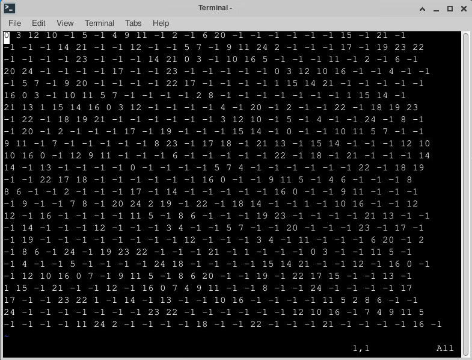
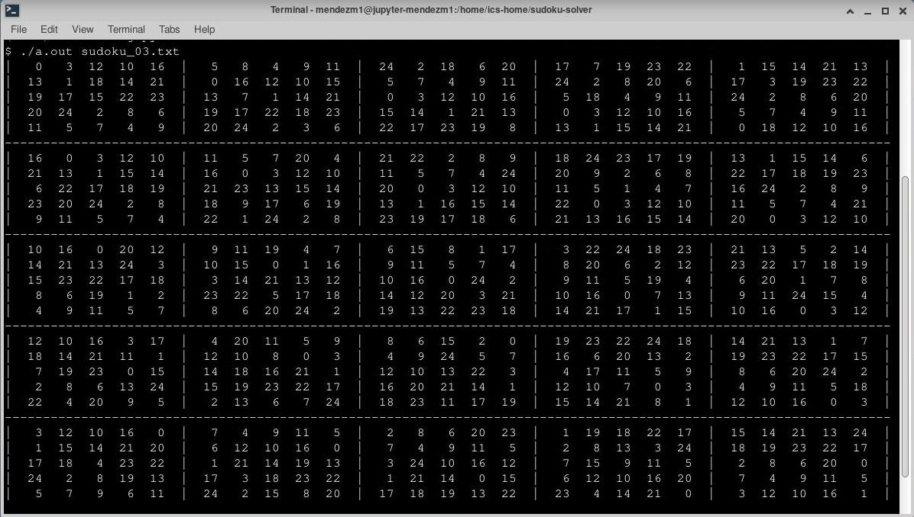

# Sudoku Solver
This project implements a sudoku solver using C++ for two solver algorithms. The first is Dancing Links while the second is Algorithm X. Both algorithms were designed by Donald Knuth (arXiv:cs/0011047).

## Technologies
The programs in this project were run using the following:
* G++ 9.3

## Setup
After cloning or forking the repository, you can run the program through the command line in the below manner:
1. You will want to `cd` into the repository
2. Compile either CPP file to test the solver with the desired algorithm
   - An example of this would be `g++ main_dancing_links.cpp`
3. Run the executable created and provide a text file for the sudoku puzzle being solved
   - An example of this would be `./a.out sudoku_01.txt`

## Output
### Before

### After

